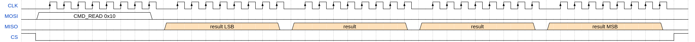
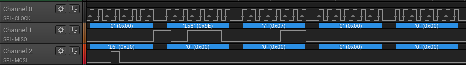
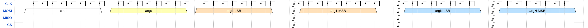
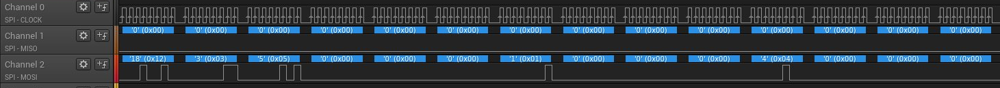

# SPI calculator
Rasperry PI is SPI master sending commands to SPI slave STM32.

## Communication
First byte of each transfer is command byte.

If it is reading command (currently only *CMD_READ*), then it is followed by 4 empty bytes in which STM32 will respond on MISO line.

All other commands are write only. The next byte contains total number of transferred arguments. Following bytes contains arguments each 4 bytes long.

Command | Name          | Description
--------| ------------- | ------------------
0x10    | CMD_READ      | Read current result
0x11    | CMD_SET       | Set result to first argument
0x12    | CMD_ADD       | Add arguments to result
0x13    | CMD_SUB       | Subtract arguments from result
0x14    | CMD_AND       | Apply logical *and* over result and all arguments
0x15    | CMD_OR        | Apply logical *or* over result and all arguments
